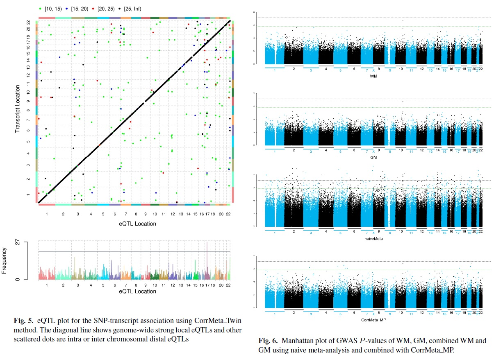

# TwinMeta: Fast Association Analysis for eQTL and GWAS with Twin and Related Samples

## Introduction

CorrMeta is a computationally efficient alternative to a linear mixed-effects model (LMM) for twin genome-wide association study (GWAS) or expression quantitative trait loci (eQTL) analysis. Instead of analyzing all twin samples together with LMM, CorrMeta first randomly splits twin samples into two independent groups on which multiple linear regression analysis is performed separately, followed by an appropriate meta-analysis to combine the two non-independent test results. Similar idea is also extended to combine GWAS results from multiple correlated phenotypes through CorrMeta. Our approaches provide a huge leap in terms of computing performance for GWAS data with twin pairs or related subjects. 




## Key features
1. Similar to meta-analysis, only summarized SNP level test statistics are necessary
2. Fast alternative to linear mixed effect model with no inflation of type I error and negligible power loss
3. Fast standard GWAS analysis for twin or correlated subjects
4. Fast expression quantitative trait loci (eQTL) analysis for twin or correlated subjects
5. Implemented as an easy-to-use R package similar to MatrixEQTL

## Download and document
To install, download the package file CorrMeta_1.0.tar.gz and run (in R):

```r
install.packages("MatrixEQTL")
install.packages("CorrMeta_1.0.tar.gz", repos = NULL, type="source")
```

The package includes reference manual and:


Sample code (https://github.com/argossy/twinMeta/blob/master/CorrMeta_1.0.tar.gz)


Sample dataset (https://github.com/argossy/twinMeta/blob/master/data.zip)


## Basic Usage

```r
library(CorrMeta)

pvThreshold = 1e-4;

# Location of data files

data.path = paste0(find.package('CorrMeta'),'/data/');

# Joint data set file names

snps.file = paste0(data.path,'snps.txt');
gene.file = paste0(data.path,'gene.txt');
cvrt.file = paste0(data.path,'cvrt.txt');

# Load joint data sets

snps = SlicedData$new()$LoadFile(snps.file, sliceSize = 50000);
gene = SlicedData$new()$LoadFile(gene.file, sliceSize = 100);
cvrt = SlicedData$new()$LoadFile(cvrt.file);

# Indicator for samples in set 1

set1 = ((1:ncol(gene)) %% 2) == 1;

# Create set 1 of data (odd samples), preserving original sets

snps1 = snps$Clone()$ColumnSubsample(set1);
gene1 = gene$Clone()$ColumnSubsample(set1);
cvrt1 = cvrt$Clone()$ColumnSubsample(set1);

# Create set 2 of data (even samples), destroying original sets

snps2 = snps$ColumnSubsample(!set1);
gene2 = gene$ColumnSubsample(!set1);
cvrt2 = cvrt$ColumnSubsample(!set1);
rm(cvrt, gene, snps);

# Run the analysis

result = CorrMeta_testAll(snps1, gene1, cvrt1,
  snps2, gene2, cvrt2,
  pvThreshold)

# Display the results

head(result)
```

## Citation
Xia, K, Shabalin, AA ... Zou, F. TwinMeta: Fast Association Analysis for eQTL and GWAS Data with Correlated Samples. (Submitted)

## Contact
Kai Xia: kxia@med.unc.edu

Andrey A Shabalin: andrey.shabalin@gmail.com

Fei Zou: fzou@bios.unc.edu


